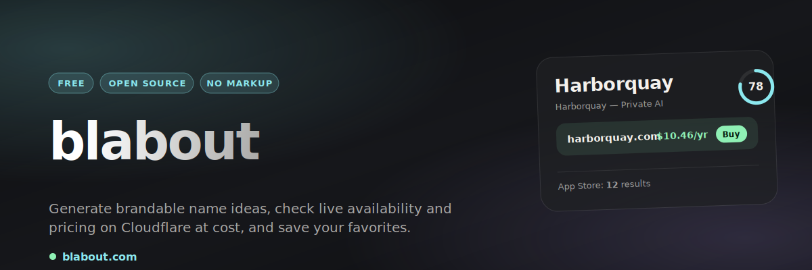

<a href="https://blabout.com"></a>

<p>
  <a href="https://blabout.com"></a>
  <a href="https://blabout.com"></a>
  <a href="https://blabout.com"></a>
  
</p>

# Cloudflare Domain Finder

## About

Cloudflare Domain Finder is a free, open-source tool I built to help people find available domain names on Cloudflare with no markup. Save your favorites and settle on the best one for your business or blog.

## How it works

- AI generates diverse, brandable name ideas (Workers AI Llama, routed through AI Gateway).
- Live `.com` and multi-TLD availability and pricing come straight from the Cloudflare Registrar API — at Cloudflare's at-cost pricing.
- App Store collision check via the Apple Search API; live seed-word suggestions as you type.
- Create an account to bookmark the domains you like and compare them in one place.
- A Cloudflare Worker, with users and bookmarks in D1. Deployed at `https://blabout.com`.

## Commands

```bash
npm ci
npm run check
npm run deploy
```

## Secrets Management

This project uses [Doppler](https://doppler.com) for secret management.

To set up Doppler for development:

```bash
doppler setup
```

To run with secrets:

```bash
doppler run -- npm run dev
```

To deploy with secrets:

```bash
doppler run -- npm run deploy
```
